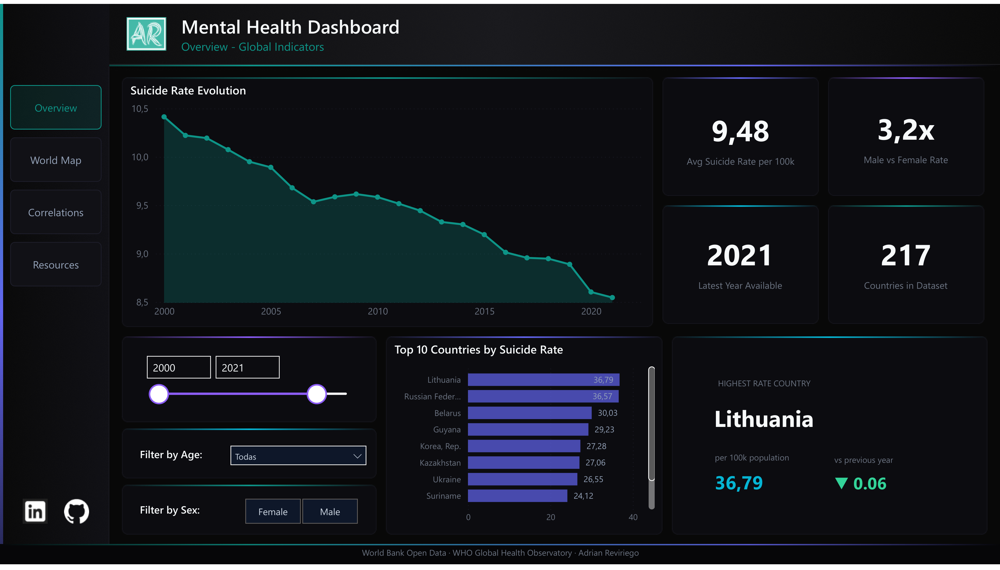
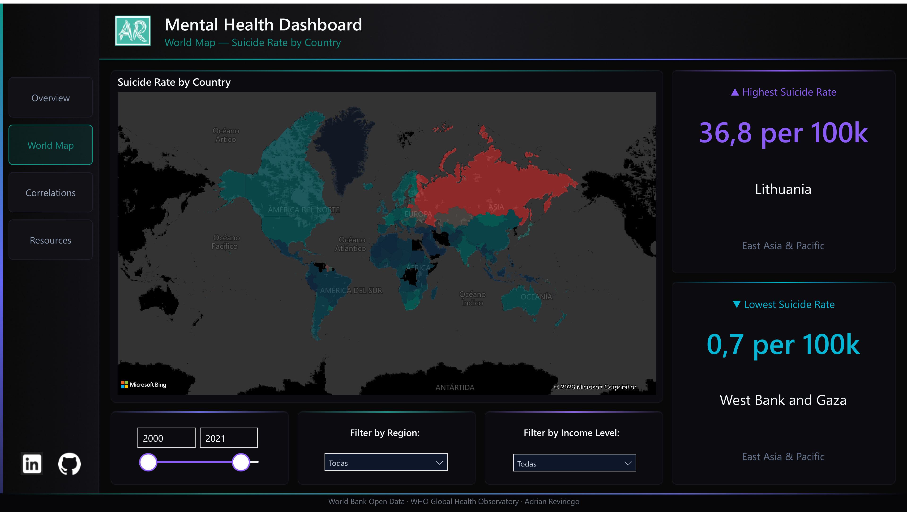
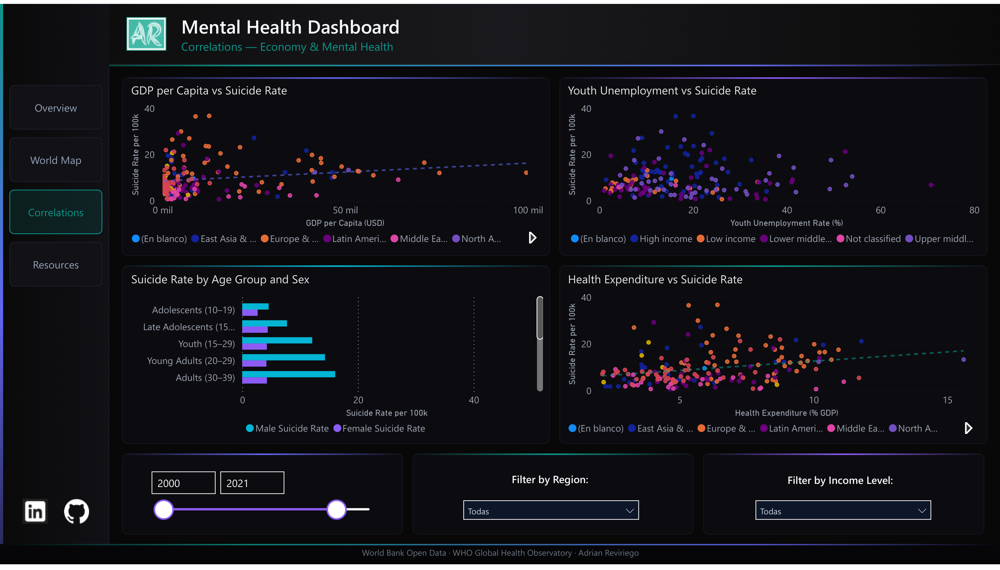
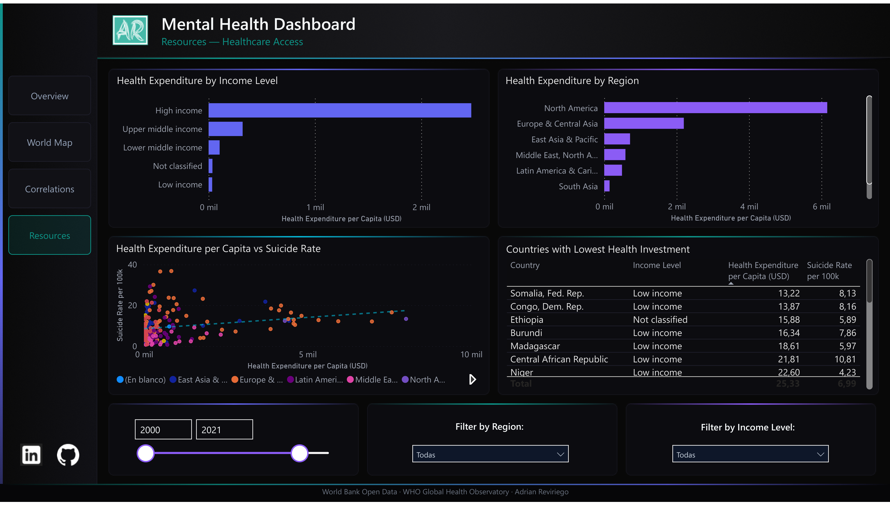

# Mental Health Pipeline

An end-to-end ETL pipeline on public mental health data following the **Medallion Architecture** (Bronze → Silver → Gold).

**Stack:** Python · pandas · Great Expectations · DuckDB · GitHub Actions · Power BI  
**Cost:** €0 — fully local, no cloud services required  
**Data:** World Bank API · WHO Global Health Observatory API

[](https://app.powerbi.com/view?r=eyJrIjoiNWFjM2M3YjAtOWMwYy00Nzk2LTg5YmItZjNjMGEzZWY3ZjUxIiwidCI6ImI5NmJkNTk4LTAzMGMtNDc3MS1iNzg4LTk0NjU0YzgyYThiZiJ9)

---

## Dashboard Preview

| Overview | World Map |
|---|---|
|  |  |

| Correlations | Resources |
|---|---|
|  |  |

---

## Architecture

```
World Bank API                     WHO GHO API
(13 indicators: GDP, unemployment, (9 indicators: mental health facilities,
 suicide rates, health expenditure,  psychiatric resources, suicide rates
 life expectancy, inequality...)     by age group and sex — SDGSUICIDE)
        │                                   │
        └──────────────┬────────────────────┘
                       ▼
               Bronze Layer              data/bronze/
               23 raw CSVs — never modified
                       │
                       ▼
               Silver Layer              data/silver/
               Cleaned, typed, joined into 2 Parquet files:
               • mental_health.parquet   (country × year, 23 metrics)
               • suicide_by_age.parquet  (country × year × age × sex)
               Validated with Great Expectations (20+ rules)
                       │
                       ▼
               Gold Layer               data/gold/
               Star schema: 3 dimensions + 2 fact tables (5 Parquet files)
                       │
                       ▼
               DuckDB                   data/mental_health.duckdb
               Queryable with SQL · connected from Power BI via ODBC
                       │
                       ▼
               Power BI Dashboard       dashboard/
               4-page interactive report (PBIP format)
```

---

## Data Sources

### World Bank API (free, no authentication)

| Bronze file | Indicator | Metric |
|---|---|---|
| `worldbank_gdp.csv` | `NY.GDP.PCAP.CD` | GDP per capita (current US$) |
| `worldbank_unemployment.csv` | `SL.UEM.TOTL.ZS` | Unemployment rate (% labour force) |
| `worldbank_unemployment_male.csv` | `SL.UEM.TOTL.MA.ZS` | Male unemployment rate |
| `worldbank_unemployment_female.csv` | `SL.UEM.TOTL.FE.ZS` | Female unemployment rate |
| `worldbank_youth_unemployment.csv` | `SL.UEM.1524.ZS` | Youth unemployment 15–24 (%) |
| `worldbank_gini.csv` | `SI.POV.GINI` | GINI index (income inequality) |
| `worldbank_urban.csv` | `SP.URB.TOTL.IN.ZS` | Urban population (% of total) |
| `worldbank_suicide.csv` | `SH.STA.SUIC.P5` | Suicide mortality rate (per 100k) |
| `worldbank_suicide_male.csv` | `SH.STA.SUIC.MA.P5` | Male suicide rate (per 100k) |
| `worldbank_suicide_female.csv` | `SH.STA.SUIC.FE.P5` | Female suicide rate (per 100k) |
| `worldbank_health_expenditure.csv` | `SH.XPD.CHEX.PC.CD` | Health expenditure per capita (US$) |
| `worldbank_health_expenditure_gdp.csv` | `SH.XPD.CHEX.GD.ZS` | Health expenditure (% of GDP) |
| `worldbank_life_expectancy.csv` | `SP.DYN.LE00.IN` | Life expectancy at birth (years) |
| `worldbank_countries.csv` | `/country` | Country metadata: region, income level, capital, lat/lon |

### WHO Global Health Observatory API (free, no authentication)

| Bronze file | Indicator | Metric |
|---|---|---|
| `who_outpatient_facilities.csv` | `MH_6` | Mental health outpatient facilities (per 100k) |
| `who_mental_hospitals.csv` | `MH_1` | Mental hospitals (per 100k) |
| `who_psychiatric_beds.csv` | `MH_2` | Psychiatric beds (per 100k) |
| `who_psychiatrists.csv` | `MH_3` | Psychiatrists in mental health (per 100k) |
| `who_mh_nurses.csv` | `MH_4` | Mental health nurses (per 100k) |
| `who_psychologists.csv` | `MH_5` | Psychologists in mental health (per 100k) |
| `who_day_treatment.csv` | `MH_7` | Day treatment facilities (per 100k) |
| `who_mh_expenditure.csv` | `MH_12` | Mental health expenditure (% of health budget) |
| `who_suicide_by_age.csv` | `SDGSUICIDE` | Suicide mortality rate by age group and sex |

---

## Star Schema (Gold Layer)

Five tables — three dimensions and two fact tables at different grains.

```
dim_country                          dim_year              dim_age
───────────                          ────────              ───────
country_code  PK                     year        PK        age_group  PK
country                              decade                age_order
region                               period_label          age_label
income_level
capital_city
latitude / longitude

     │                                   │                    │
     └────────────┬──────────────────────┘                    │
                  ▼                                           │
       fact_mental_health                                     │
       ──────────────────                                     │
       country_code  FK → dim_country     Grain: 1 row per   │
       year          FK → dim_year        country × year      │
       gdp_per_capita                                         │
       unemployment_rate / _male / _female                    │
       youth_unemployment_rate                                │
       gini_index · urban_population_pct                      │
       suicide_rate_per_100k / _male / _female                │
       health_expenditure_per_capita / _gdp_pct               │
       life_expectancy                                        │
       outpatient_facilities · mental_hospitals               │
       psychiatric_beds · psychiatrists_per_100k              │
       mh_nurses_per_100k · psychologists_per_100k            │
       day_treatment_facilities · mh_expenditure_pct          │
                                                              │
     dim_country ──┐                                          │
     dim_year    ──┤                                          │
     dim_age     ──┘                                          │
                  ▼                                           │
       fact_suicide_by_age      ◄────────────────────────────┘
       ───────────────────
       country_code  FK → dim_country     Grain: 1 row per
       year          FK → dim_year        country × year ×
       age_group     FK → dim_age         age_group × sex
       sex
       suicide_rate_per_100k
```

---

## Pipeline Flow

```
ingest.py            Downloads 23 sources from 2 APIs → data/bronze/
transform_silver.py  Cleans, standardises, joins → data/silver/ (2 Parquet files)
quality_checks.py    20+ Great Expectations rules — fails loudly on bad data
transform_gold.py    Builds star schema → data/gold/ (5 Parquet files)
load_duckdb.py       Loads gold tables → data/mental_health.duckdb
```

Each script is independent and exits with code 1 on failure, stopping the pipeline at the broken stage.

---

## Quick Start

```bash
# 1. Clone and create virtual environment
git clone https://github.com/AdrianRevi/mental-health-pipeline.git
cd mental-health-pipeline
python -m venv venv
venv\Scripts\activate        # Windows
# source venv/bin/activate   # macOS / Linux

# 2. Install dependencies
pip install -r requirements.txt

# 3. Run the full pipeline
python scripts/ingest.py
python scripts/transform_silver.py
python scripts/quality_checks.py
python scripts/transform_gold.py
python scripts/load_duckdb.py
```

All output lands in `data/`, all run logs in `logs/`.

---

## Automated Runs (GitHub Actions)

The pipeline runs automatically via `.github/workflows/pipeline.yml`:

- **On every push** to `main`
- **Every Monday at 08:00 UTC**

Each script runs as a separate step. GitHub sends an email notification if any step fails. The Actions tab shows exactly which stage broke and how long each step took.

---

## Power BI Dashboard

The dashboard is stored in PBIP format (Power BI Project — human-readable text files, Git-friendly) under `dashboard/`. It connects to DuckDB via a local ODBC DSN named `mental_health_duckdb`.

**4 pages:**

| Page | Content |
|---|---|
| **Overview** | KPI cards (avg suicide rate, male/female ratio, countries count, latest year), trend area chart, top/bottom country rankings, age group breakdown |
| **World Map** | Choropleth map of suicide rates by country, filterable by year, region, and income level |
| **Correlations** | Scatter plots: suicide rate vs. GDP per capita, unemployment, and health expenditure; bar chart by region — shows socioeconomic relationships |
| **Resources** | Health expenditure scatter, resource distribution by income level, country-level data table, trend over time — shows healthcare investment gaps |

**To open:** configure the ODBC DSN (see below), then open `dashboard/mental-health-dashboard.pbip` in Power BI Desktop.

```
# Windows ODBC setup (one-time):
# 1. Install DuckDB ODBC driver from https://duckdb.org/docs/api/odbc
# 2. Create a DSN named "mental_health_duckdb" pointing to data/mental_health.duckdb
```

---

## Querying with DuckDB

```python
import duckdb

con = duckdb.connect("data/mental_health.duckdb")

# Suicide rate vs. GDP per capita by region and decade
con.execute("""
    SELECT
        c.region,
        y.decade,
        ROUND(AVG(f.suicide_rate_per_100k), 2)   AS avg_suicide_rate,
        ROUND(AVG(f.gdp_per_capita), 0)           AS avg_gdp,
        ROUND(AVG(f.health_expenditure_per_capita), 0) AS avg_health_exp
    FROM fact_mental_health f
    JOIN dim_country c ON f.country_code = c.country_code
    JOIN dim_year    y ON f.year         = y.year
    WHERE f.suicide_rate_per_100k IS NOT NULL
    GROUP BY c.region, y.decade
    ORDER BY avg_suicide_rate DESC
""").df()
```

```python
# WHO age-stratified suicide rates — male vs. female, latest year
con.execute("""
    SELECT
        a.age_label,
        ROUND(AVG(CASE WHEN s.sex = 'Male'   THEN s.suicide_rate_per_100k END), 2) AS male_rate,
        ROUND(AVG(CASE WHEN s.sex = 'Female' THEN s.suicide_rate_per_100k END), 2) AS female_rate
    FROM fact_suicide_by_age s
    JOIN dim_age a ON s.age_group = a.age_group
    WHERE s.year = (SELECT MAX(year) FROM fact_suicide_by_age)
      AND s.age_group <> 'All Ages'
    GROUP BY a.age_label, a.age_order
    ORDER BY a.age_order
""").df()
```

---

## Project Structure

```
mental-health-pipeline/
│
├── data/
│   ├── bronze/              raw CSVs from APIs (gitignored)
│   ├── silver/              cleaned Parquet files (gitignored)
│   ├── gold/                star schema Parquet files (gitignored)
│   └── mental_health.duckdb analytical database (gitignored)
│
├── scripts/
│   ├── ingest.py            Bronze — downloads 23 sources from 2 APIs
│   ├── transform_silver.py  Silver — cleaning, standardising, joining
│   ├── quality_checks.py    Great Expectations validation (20+ rules)
│   ├── transform_gold.py    Gold — builds 5-table star schema
│   └── load_duckdb.py       Loads gold Parquet files into DuckDB
│
├── dashboard/
│   ├── mental-health-dashboard.SemanticModel/   TMDL semantic model
│   └── mental-health-dashboard.Report/          PBIR report (4 pages)
│
├── .github/workflows/
│   └── pipeline.yml         GitHub Actions (push + weekly schedule)
│
├── logs/                    Runtime logs per script (gitignored)
├── requirements.txt
└── README.md
```

---

**Data sources:** [World Bank Open Data](https://data.worldbank.org) · [WHO Global Health Observatory](https://www.who.int/data/gho)  
Built by [Adrian Reviriego](https://www.linkedin.com/in/adrian-reviriego/) · [GitHub](https://github.com/AdrianRevi)
